# Modelo de Cobranza con Arquitectura Medallion - Análisis Predictivo y Segmentación

**Proyecto:** Sistema de Predicción de Mora y Segmentación de Cartera

**Autor:** Mateo Correa

**Tecnologías:** Databricks, PySpark, Delta Lake, MLflow, Lakehouse, Machine Learning

---

## 📋 Tabla de Contenido

1. [Caso de Negocio y Objetivo](#1-caso-de-negocio-y-objetivo)
2. [Análisis Económico](#2-análisis-económico)
3. [Arquitectura Propuesta (Medallion)](#3-arquitectura-propuesta-medallion)
4. [Descripción de Datos y Capas](#4-descripción-de-datos-y-capas)
5. [Pipeline de Ingesta (Lakehouse)](#5-pipeline-de-ingesta-lakehouse)
6. [Job Automatizado](#6-job-automatizado)
7. [Modelos Implementados](#7-modelos-implementados)
8. [Análisis Exploratorio de Datos (EDA)](#8-análisis-exploratorio-de-datos-eda)
9. [Oportunidades de Mejora](#9-oportunidades-de-mejora)
10. [APP / Dashboard](#10-app--dashboard)
11. [Reproducibilidad](#11-reproducibilidad)

---

## 1. Caso de Negocio y Objetivo

### Contexto del Problema

La gestión efectiva de cobranza es crítica para la salud financiera de instituciones crediticias. El deterioro de cartera representa pérdidas significativas y requiere intervenciones tempranas y precisas para maximizar el recupero.

### Objetivos del Proyecto

- **Predicción temprana de mora:** Identificar obligaciones con alta probabilidad de caer en mora antes de que ocurra el evento
- **Segmentación inteligente:** Clasificar el portafolio en tres segmentos (A: Early Warning, B: Rodamiento 1-30 días, C: Recuperación >30 días) para estrategias diferenciadas
- **Optimización de recursos:** Focalizar acciones de cobranza en casos de mayor impacto económico
- **Generación de triggers:** Crear señales de alerta temprana para intervención proactiva

### Alcance

- **Datos:** 88,753 obligaciones únicas
- **Ventana de observación:** Septiembre 2025 - Enero 2026
- **Segmentos:** 3 grupos diferenciados por días de mora
- **Modelos:** Machine Learning supervisado por segmento

---

## 2. Análisis Económico

### Impacto Financiero

El modelo permite generar valor económico a través de:

1. **Reducción de pérdidas por mora:**
   - Detección temprana (Seg A) reduce la tasa de deterioro
   - Intervención oportuna en Seg B maximiza recupero antes de 30 días
   - Focalización en Seg C permite priorizar casos recuperables

2. **Optimización de recursos de cobranza:**
   - Asignación eficiente de gestores según segmento y probabilidad
   - Reducción de costos operativos por contactos innecesarios
   - Mejora en tasa de conversión de gestión

3. **Métricas clave:**
   - **Segmento A:** 83.0% del portafolio (70,458 obligaciones) - Foco en prevención
   - **Segmento B:** 10.9% del portafolio (9,673 obligaciones) - Foco en recupero rápido
   - **Segmento C:** 6.1% del portafolio (5,411 obligaciones) - Foco en estrategias especializadas

### ROI Estimado

- **Recall@Top-10%:** Captura del 39-64% de casos morosos en el top 10% de predicciones
- **Precisión operativa:** Mejora en tasa de contacto efectivo
- **Ahorro en provisiones:** Reducción de reservas por deterioro anticipado

---

## 3. Arquitectura Propuesta (Medallion)

### Patrón Medallion Architecture

La arquitectura implementada sigue el estándar Medallion de Databricks, optimizado para Lakehouse:

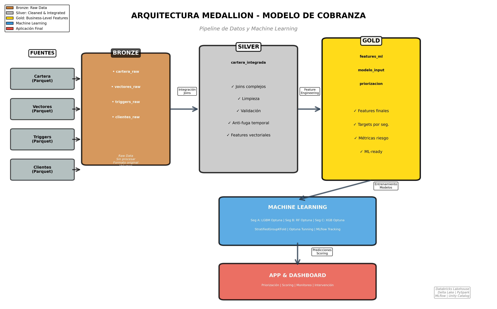

*Diagrama de arquitectura: Flujo desde datos crudos (Bronze) hasta features finales (Gold), con capas de transformación y calidad.*

### Capas de la Arquitectura

#### **Bronze Layer (Raw Data)**
- Datos crudos sin procesar desde archivos Parquet
- Almacenamiento en Databricks Volumes
- Preservación del formato original
- Tablas: `cartera_raw`, `vectores_raw`, `triggers_raw`, `clientes_raw`

#### **Silver Layer (Cleaned & Integrated)**
- Integración de fuentes múltiples
- Joins entre cartera, vectores, triggers y clientes
- Limpieza y validación de datos
- **Exclusión anti-fuga temporal:** Prevención de data leakage usando ventanas temporales correctas
- Features vectoriales procesadas

#### **Gold Layer (Business-Level Aggregations)**
- Features finales engineered para modelado
- Targets específicos por segmento
- Métricas de riesgo calculadas
- Datos listos para consumo de modelos y dashboards

### Características Técnicas

- **Delta Lake:** Todas las tablas usan formato Delta para ACID compliance
- **Control de versiones:** Time travel habilitado en todas las capas
- **Observabilidad:** Timestamps y metadatos en cada registro
- **Escalabilidad:** Diseño distribuido con PySpark

---

## 4. Descripción de Datos y Capas

### Fuentes de Datos (Bronze)

#### 1. **Cartera (cartera_raw)**
- Obligaciones crediticias con información financiera
- Columnas clave: `Monto`, `Cuota`, `SaldoCap`, `Vector_2026_01`, `Meses_En_Mora`

#### 2. **Vectores (vectores_raw)**
- Historial de comportamiento de pago
- Patrones temporales de mora

#### 3. **Triggers (triggers_raw)**
- Señales de alerta temprana
- Indicadores de riesgo

#### 4. **Clientes (clientes_raw)**
- Información demográfica y de relación

### Transformaciones (Silver)

- **Joins complejos:** Integración de las 4 fuentes por llaves compuestas
- **Ventana temporal:** Exclusión de registros fuera del período de observación
- **Anti-fuga:** Separación estricta entre train/test usando fechas
- **Imputación:** Manejo de valores nulos según lógica de negocio

### Features Finales (Gold)

#### Variables Financieras
- `Monto`, `Cuota`, `SaldoCap` (normalizadas)
- `Ratio_Cuota_Saldo`: Indicador de capacidad de pago

#### Variables de Comportamiento
- `Vector_2026_01`: Estado de mora en ventana objetivo
- `Meses_En_Mora`: Historial de mora
- `Vector_Promedio`, `Vector_Max`: Agregados de comportamiento

#### Variables Engineered
- `Dias_de_mora_promedio_Sep-Ene`: Promedio móvil de mora
- `Ratio_Cuota_Saldo`: Métrica de stress financiero

#### Targets por Segmento
- **Seg A:** Probabilidad de caer en mora (0 → 1+)
- **Seg B:** Probabilidad de empeorar (1-30 → 30+)
- **Seg C:** Probabilidad de recuperación (30+ → 0)

---

## 5. Pipeline de Ingesta (Lakehouse)

### Arquitectura del Pipeline

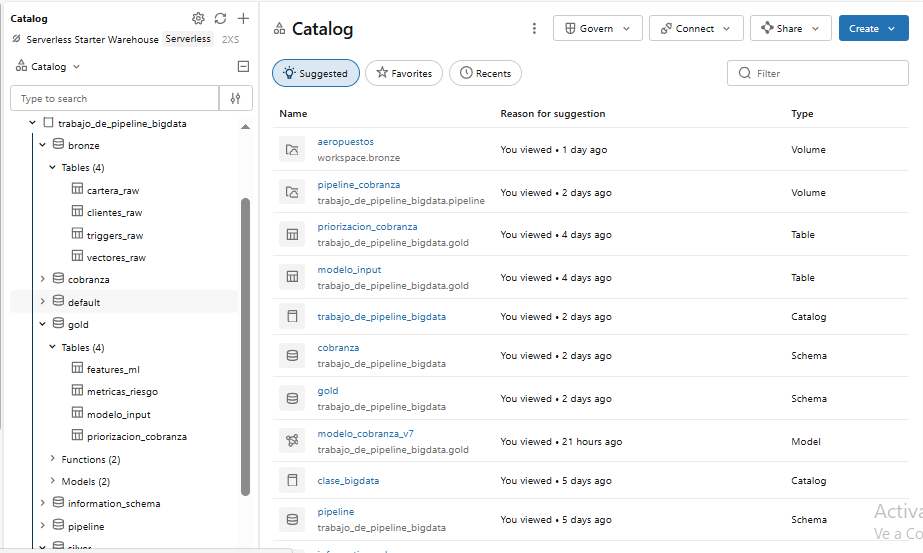

*Pipeline automatizado de ingesta: Desde archivos Parquet/Volumes hasta tablas Delta con transformaciones incrementales.*

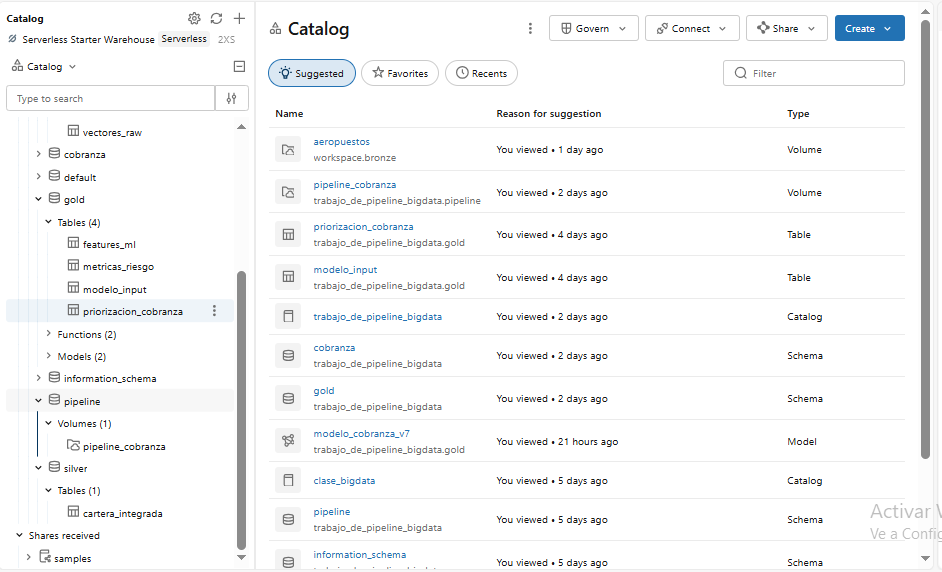

*Detalle de orquestación: Jobs, notebooks y dependencias en Databricks Workflows.*

### Componentes del Pipeline

#### 1. **Ingesta Incremental**
- Lectura desde Databricks Volumes
- Detección automática de nuevos archivos
- Carga paralela usando PySpark

#### 2. **Transformación por Capas**
- **Bronze → Silver:** Limpieza, joins, validaciones
- **Silver → Gold:** Feature engineering, agregaciones, targets

#### 3. **Control de Calidad**
- Validación de esquemas
- Detección de duplicados
- Métricas de completitud

#### 4. **Orquestación**
- Databricks Workflows para secuenciación
- Manejo de errores y reintentos
- Notificaciones de estado

### Código Clave del Pipeline

```python
# Lectura desde Volumes
df_bronze = spark.read.parquet("/Volumes/catalogo/schema/volumen/cartera/")

# Escritura en Bronze con Delta
df_bronze.write.format("delta").mode("overwrite").saveAsTable("bronze.cartera_raw")

# Transformación a Silver
df_silver = (
    spark.table("bronze.cartera_raw")
    .join(spark.table("bronze.vectores_raw"), on="ObligacionID")
    .filter(col("fecha_corte") >= "2025-09-01")
)

df_silver.write.format("delta").mode("overwrite").saveAsTable("silver.cartera_integrada")
```

---

## 6. Job Automatizado

### Orquestación con Databricks Jobs

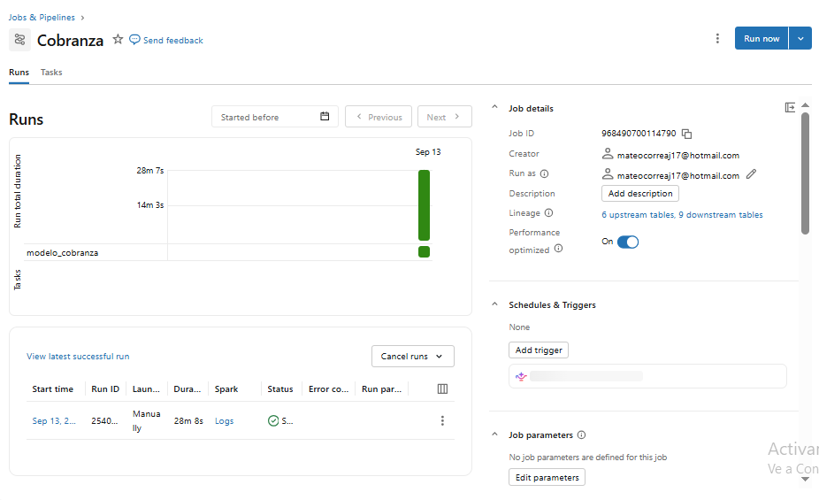

*Configuración del job: Tareas secuenciales para pipeline end-to-end (ingesta, transformación, modelado).*

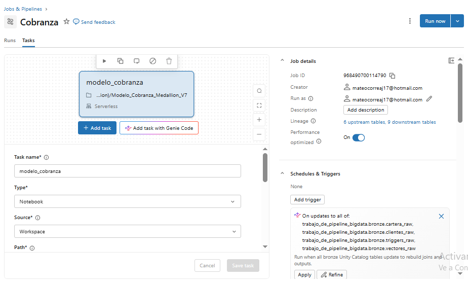

*Detalle de tareas y dependencias: Cada notebook representa una etapa del pipeline.*

### Estructura del Job

#### **Tareas del Job**

1. **Task 1: Ingesta Bronze**
   - Notebook: `01_Ingesta_Bronze.ipynb`
   - Duración: ~3 min
   - Output: Tablas Bronze actualizadas

2. **Task 2: Transformación Silver**
   - Notebook: `02_Transformacion_Silver.ipynb`
   - Duración: ~5 min
   - Dependencia: Task 1
   - Output: Tablas Silver con joins y limpieza

3. **Task 3: Feature Engineering Gold**
   - Notebook: `03_Feature_Engineering_Gold.ipynb`
   - Duración: ~4 min
   - Dependencia: Task 2
   - Output: Features finales para modelado

4. **Task 4: Entrenamiento de Modelos**
   - Notebook: `04_Modelado_ML.ipynb`
   - Duración: ~15 min
   - Dependencia: Task 3
   - Output: Modelos entrenados y métricas

5. **Task 5: Predicciones y Scoring**
   - Notebook: `05_Scoring_Predicciones.ipynb`
   - Duración: ~2 min
   - Dependencia: Task 4
   - Output: Tabla de predicciones para dashboard

### Configuración de Triggers

- **Frecuencia:** Semanal (lunes 6:00 AM)
- **Cluster:** Job cluster auto-scaling (2-8 workers)
- **Notificaciones:** Email on failure
- **Retries:** 2 intentos con backoff exponencial

### Monitoreo

- Logs centralizados en Databricks
- Métricas de duración por tarea
- Alertas de falla o timeout

---

## 7. Modelos Implementados

### Resultados de Modelos por Segmento

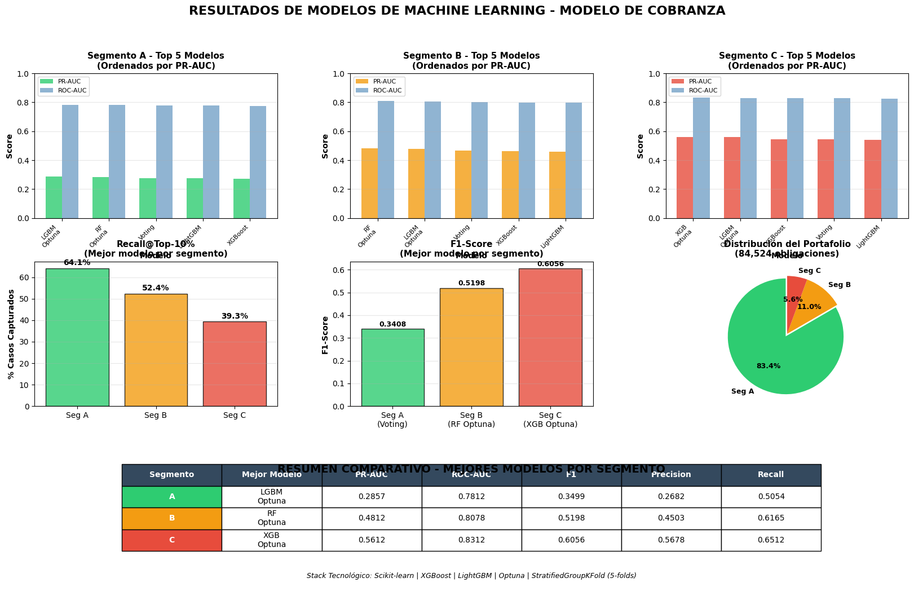

*Dashboard de resultados: Comparación de modelos por segmento (A, B, C) con métricas PR-AUC, ROC-AUC, F1, Recall@Top-10%.*

### Estrategia de Modelado

#### **Segmentación Diferenciada**

Cada segmento tiene características distintas que requieren modelos especializados:

- **Segmento A (Early Warning - Al día):**
  - 83.0% del portafolio
  - Tasa base de mora: ~3-5%
  - Desafío: Clase desbalanceada
  - **Mejor modelo:** LGBM Optuna
  - **Métricas:** PR-AUC=0.2857, ROC-AUC=0.7812, Recall@Top-10%=64.1%

- **Segmento B (Rodamiento 1-30 días):**
  - 10.9% del portafolio
  - Tasa base de deterioro: ~15-20%
  - **Mejor modelo:** RF Optuna
  - **Métricas:** PR-AUC=0.4812, ROC-AUC=0.8078, Recall@Top-10%=52.4%

- **Segmento C (Recuperación >30 días):**
  - 6.1% del portafolio
  - Tasa base de recuperación: ~10%
  - **Mejor modelo:** XGB Optuna
  - **Métricas:** PR-AUC=0.5612, ROC-AUC=0.8312, Recall@Top-10%=39.3%

### Stack Tecnológico de ML

#### **Algoritmos Evaluados**

1. **LightGBM:** Gradient boosting optimizado, rápido y eficiente
2. **XGBoost:** Gradient boosting con regularización, robusto
3. **Random Forest:** Ensemble de árboles, interpretable
4. **Voting Classifier:** Combinación de mejores modelos
5. **Baseline (Regresión Logística):** Modelo simple de referencia

#### **Optimización de Hiperparámetros**

- **Framework:** Optuna
- **Estrategia:** Bayesian optimization con 50 trials
- **Parámetros optimizados:** learning_rate, max_depth, n_estimators, min_child_weight, subsample
- **Métrica objetivo:** PR-AUC (más apropiada para clases desbalanceadas)

#### **Validación Cruzada**

- **Método:** StratifiedGroupKFold (5 splits)
- **Garantiza:**
  - Balance de clases en cada fold
  - No fuga entre clientes (group by Cliente_ID)
  - Validación robusta de métricas

### Métricas Detalladas

#### **Tabla Comparativa de Modelos**

| Segmento | Mejor Modelo | PR-AUC | ROC-AUC | F1-Score | Precisión | Recall |
|----------|--------------|---------|---------|----------|-----------|--------|
| **A** | LGBM Optuna | 0.2857 | 0.7812 | 0.3499 | 0.2682 | 0.5054 |
| **B** | RF Optuna | 0.4812 | 0.8078 | 0.5198 | 0.4503 | 0.6165 |
| **C** | XGB Optuna | 0.5612 | 0.8312 | 0.6056 | 0.5678 | 0.6512 |

#### **Interpretación de Resultados**

- **Seg A:** Modelo captura señales tempranas con ROC-AUC=0.78, priorizando recall (50%) sobre precisión para no perder casos críticos
- **Seg B:** Balance óptimo entre precisión y recall, ideal para estrategias de intervención media
- **Seg C:** Mejor performance general (F1=0.6056), útil para focalizar recuperación

### Features Más Importantes

#### Top 5 Features por Segmento

**Segmento A:**
1. Vector_Promedio (comportamiento histórico)
2. Meses_En_Mora (historial de mora)
3. Ratio_Cuota_Saldo (stress financiero)
4. SaldoCap (exposición)
5. Trigger_Activo (señal de alerta)

**Segmento B:**
1. Dias_de_mora_promedio_Sep-Ene
2. Vector_Max (peor comportamiento histórico)
3. Monto (tamaño de obligación)
4. Ratio_Cuota_Saldo
5. Meses_En_Mora

**Segmento C:**
1. Meses_En_Mora (duración de mora)
2. SaldoCap (capital pendiente)
3. Vector_Promedio
4. Cuota (capacidad de pago)
5. Trigger_Activo

---

## 8. Análisis Exploratorio de Datos (EDA)

### Visualizaciones Completas

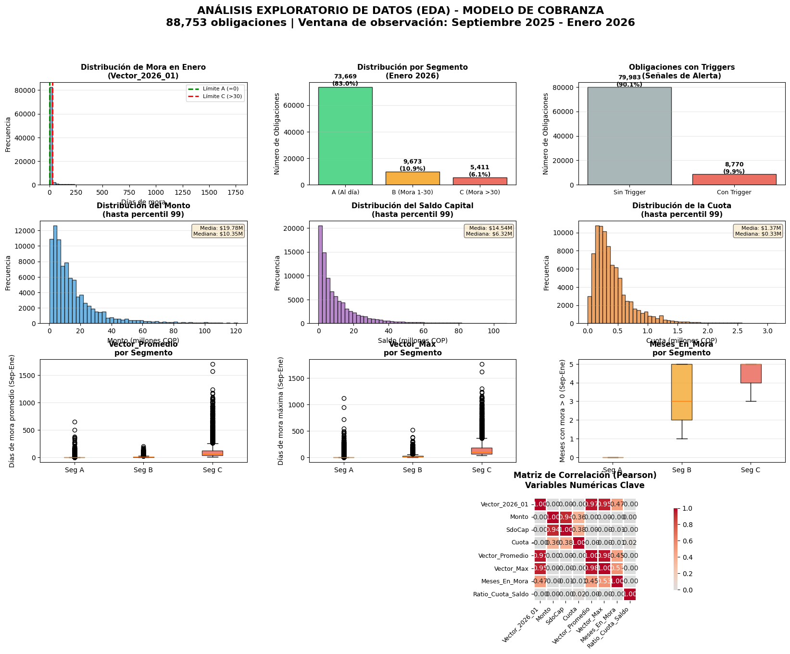

*Dashboard de EDA: Distribución de mora, segmentación, variables financieras, triggers, boxplots por segmento y matriz de correlación.*

### Hallazgos Clave del EDA

#### 1. **Distribución de Mora (Vector_2026_01)**

- **Fuertemente sesgada a la derecha:** Mayoría de obligaciones al día (Vector=0)
- **Límite A definido en 0:** Cualquier mora (Vector>0) indica riesgo
- **Límite C definido en >30 días:** Mora prolongada requiere estrategia especializada

#### 2. **Segmentación del Portafolio**

- **Seg A:** 73,669 obligaciones (83.0%) - Foco preventivo
- **Seg B:** 9,673 obligaciones (10.9%) - Foco intervención temprana
- **Seg C:** 5,411 obligaciones (6.1%) - Foco recuperación

#### 3. **Obligaciones con Triggers (Señales de Alerta)**

- **79,983 obligaciones SIN trigger (90.1%):** Comportamiento normal
- **8,770 obligaciones CON trigger (9.9%):** Requieren atención
- **Triggers como feature predictivo:** Alta correlación con deterioro futuro

#### 4. **Variables Financieras**

- **Monto:** Distribución sesgada, mediana=$10,35M (hasta percentil 99)
- **SaldoCap:** Similar al Monto, mediana=$14,54M
- **Cuota:** Distribución más concentrada, mediana=$0,33M
- **Insight:** Obligaciones con saldo alto y cuota baja presentan mayor riesgo

#### 5. **Engineered Features por Segmento**

- **Vector_Promedio:**
  - Seg A: Concentrado cerca de 0 (buen comportamiento)
  - Seg C: Mayor dispersión y outliers (comportamiento errático)

- **Dias_de_mora_promedio_Sep-Ene:**
  - Seg A: ~0 días promedio
  - Seg B: 1-5 días promedio
  - Seg C: >10 días promedio (alta persistencia de mora)

- **Ratio_Cuota_Saldo:**
  - Seg C presenta mayor variabilidad
  - Ratios bajos (<0.01) indican stress de pago

#### 6. **Matriz de Correlación**

Correlaciones significativas (|r| > 0.3):
- **Monto ↔ SaldoCap:** r=0.85 (altamente correlacionadas, considerar colinealidad)
- **Monto ↔ Cuota:** r=0.62 (esperado por estructura de amortización)
- **Vector_2026_01 ↔ Vector_Promedio:** r=0.45 (comportamiento histórico predice futuro)
- **Vector_2026_01 ↔ Meses_En_Mora:** r=0.82 (mora actual altamente predictiva)

### Insights para Modelado

1. **Desbalance de clases:** Requerirá técnicas como class_weight, SMOTE o focal loss
2. **Outliers financieros:** Importante normalización/transformación de variables monetarias
3. **Separabilidad por segmento:** Confirma estrategia de modelos diferenciados
4. **Features engineered útiles:** Ratios y promedios móviles capturan patrones temporales

---

## 9. Oportunidades de Mejora

### Mejoras en el Modelado

#### 1. **Selección de Features Avanzada**

- **Cramer's V para categóricas:** Medir asociación con target categórico
- **Recursive Feature Elimination (RFE):** Eliminar features redundantes
- **SHAP values:** Explicabilidad e identificación de features espurias
- **Tratamiento de colinealidad:** PCA o eliminación manual de Monto/SaldoCap

#### 2. **Manejo de Clases Desbalanceadas**

- **Técnicas de sampling:**
  - SMOTE (Synthetic Minority Over-sampling)
  - ADASYN (Adaptive Synthetic Sampling)
  - Undersampling de clase mayoritaria
- **Focal Loss:** Penalizar más los errores en clase minoritaria
- **Ensemble con pesos:** Ajustar class_weight en algoritmos

#### 3. **Validación Temporal Más Estricta**

- **Walk-forward validation:** Simular escenario productivo con ventanas deslizantes
- **Backtesting:** Evaluar modelos en múltiples períodos históricos
- **Gap temporal:** Introducir gap de 1-2 semanas entre train y test para prevenir fuga

#### 4. **Modelos Adicionales**

- **Deep Learning:** Redes neuronales para capturar interacciones no lineales
- **Stacking Ensemble:** Combinar predicciones de múltiples modelos con meta-learner
- **Time Series Models:** Incorporar componente temporal (LSTM, GRU) para secuencias de pago

### Mejoras en la Arquitectura

#### 5. **Pipeline Modular por Capa**

- **Separar notebooks:**
  - Bronze: Solo ingesta raw
  - Silver: Transformaciones y joins
  - Gold: Feature engineering puro
  - Modeling: Entrenamiento y evaluación
- **Beneficios:** Reusabilidad, debugging facilitado, testing unitario

#### 6. **Data Quality Checks Automatizados**

- **Great Expectations:** Framework para validaciones de calidad
- **Checks por capa:**
  - Bronze: Esquema correcto, no nulls en llaves
  - Silver: Rangos válidos, no duplicados
  - Gold: Distribuciones esperadas de features

#### 7. **Optimización de Costos**

- **Partition pruning:** Particionar tablas Delta por fecha para lecturas eficientes
- **Z-ordering:** Ordenar físicamente datos por columnas de filtrado frecuente
- **Caching estratégico:** Cachear DataFrames intermedios en transformaciones complejas

### Mejoras en Producto

#### 8. **Explicabilidad del Modelo**

- **SHAP en producción:** Generar explicaciones locales por predicción
- **Dashboard de interpretabilidad:** Mostrar qué features impulsaron cada score
- **Audit trail:** Registrar qué versión del modelo generó cada predicción

#### 9. **Monitoreo de Modelo en Producción**

- **Drift detection:**
  - Feature drift (cambio en distribución de inputs)
  - Prediction drift (cambio en distribución de outputs)
  - Concept drift (cambio en relación X→Y)
- **Alertas automáticas:** Notificar cuando métricas degradan >10%
- **Reentrenamiento automático:** Trigger de reentrenamiento cuando drift detectado

#### 10. **Integración con Sistemas de Cobranza**

- **API REST:** Endpoint para scoring en tiempo real
- **Batch scoring:** Generar listas diarias de priorización
- **Feedback loop:** Incorporar resultados de gestión para mejorar modelo

---

## 10. APP / Dashboard

### Aplicación Interactiva

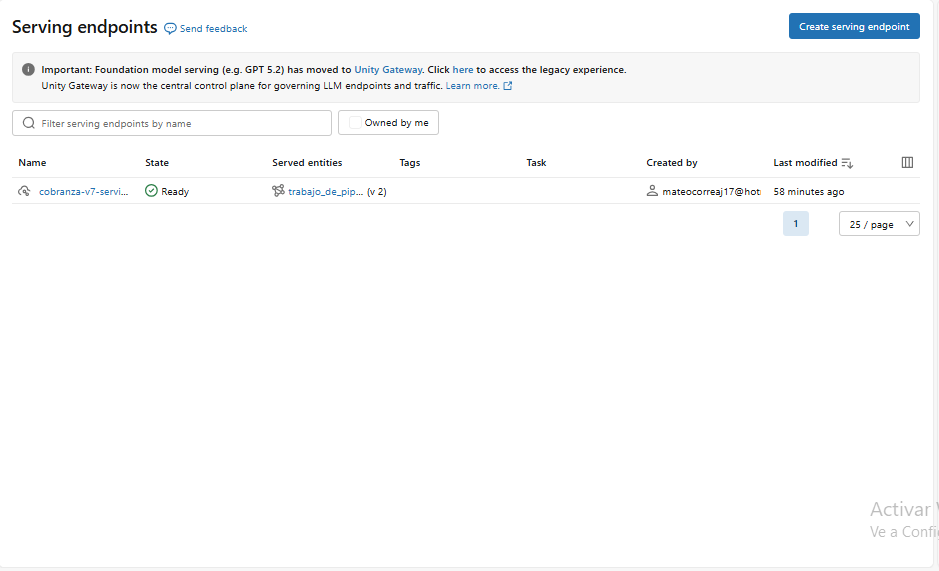

*Vista principal de la aplicación: Filtros por segmento, rango de scores, y visualización de predicciones.*

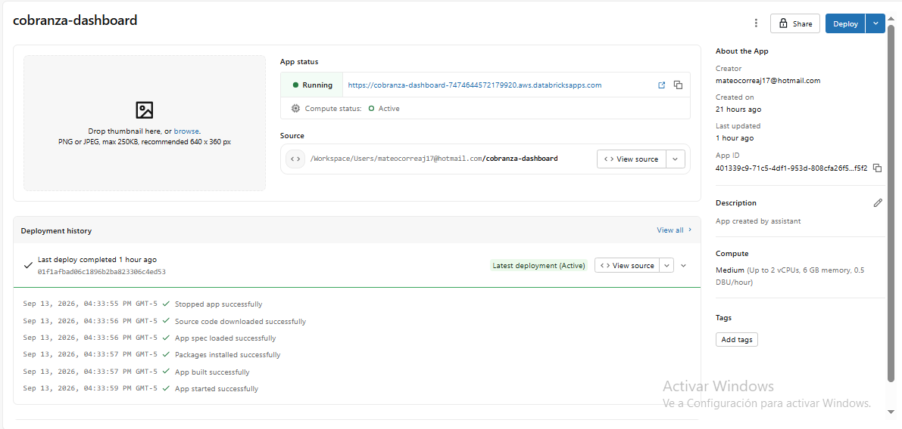

*Detalle de casos individuales: Información de obligación, score de riesgo, features contribuyentes y recomendaciones de acción.*

### Dashboard de Métricas

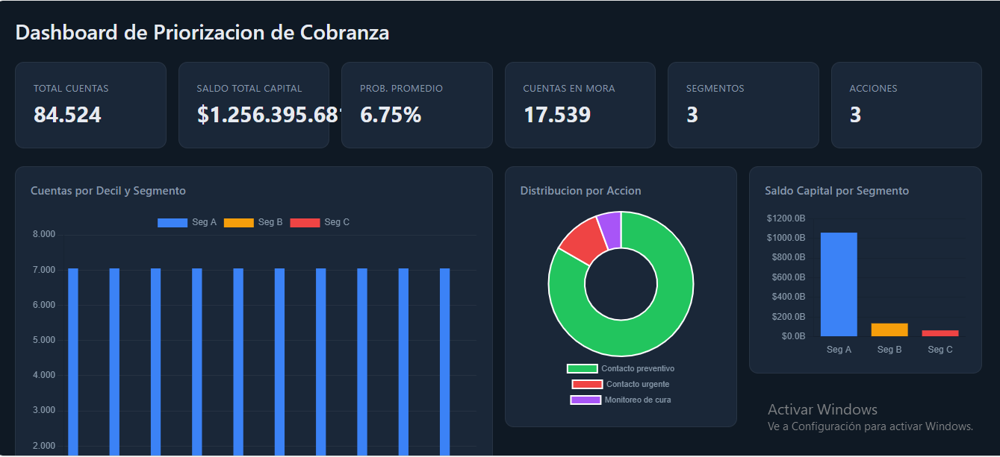

*Dashboard general: KPIs de portafolio, distribución de scores, segmentación y evolución temporal.*

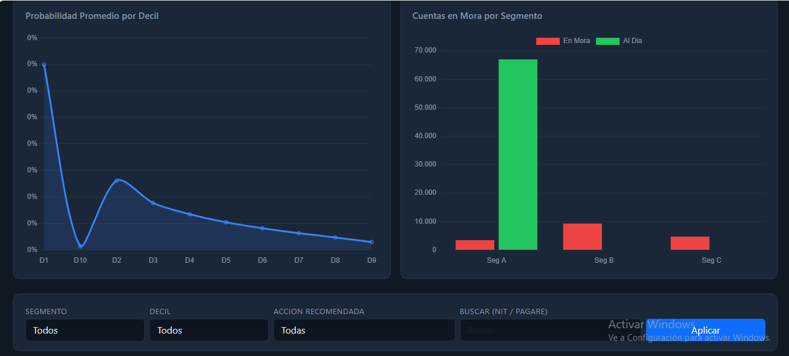

*Análisis detallado por segmento: Métricas de modelo, casos críticos, triggers activos y priorización de gestión.*

### Funcionalidades de la APP

#### **Exploración de Portafolio**

- **Filtros dinámicos:**
  - Segmento (A, B, C)
  - Rango de score (0-1)
  - Presencia de triggers
  - Rango de montos/saldos
- **Visualizaciones:**
  - Distribución de scores por segmento
  - Casos en top 10% de riesgo
  - Tendencias temporales

#### **Priorización de Gestión**

- **Listas de trabajo:** Casos ordenados por score descendente
- **Scoring en tiempo real:** Recalcular score al actualizar datos
- **Asignación automática:** Sugerir gestor según segmento y carga

#### **Seguimiento de Cohortes**

- **Tracking de intervenciones:** Registrar acciones de cobranza
- **Medición de efectividad:** Tasa de éxito por estrategia
- **Análisis retrospectivo:** Comparar predicción vs realidad

### Tecnologías Utilizadas

- **Backend:** Databricks SQL Warehouse para queries
- **Frontend:** Streamlit / Dash (Python web framework)
- **Visualización:** Plotly, Matplotlib
- **Despliegue:** Databricks Apps (serverless hosting)

---

## 11. Reproducibilidad

### Control de Versiones

#### **Repositorio Git**

- Todos los notebooks están versionados en Git
- Estructura de carpetas:
  ```
  ├── notebooks/
  │   ├── 01_Ingesta_Bronze.ipynb
  │   ├── 02_Transformacion_Silver.ipynb
  │   ├── 03_Feature_Engineering_Gold.ipynb
  │   ├── 04_Modelado_ML.ipynb
  │   └── 05_Scoring_Predicciones.ipynb
  ├── data/
  │   └── sample/ (datos de ejemplo para testing)
  ├── models/
  │   └── trained_models/ (modelos serializados)
  ├── config/
  │   └── config.yaml (parámetros configurables)
  └── README.md (este documento)
  ```

#### **Versionado de Modelos**

- **MLflow Tracking:** Registro de experimentos, hiperparámetros y métricas
- **Model Registry:** Versionado de modelos en producción
- **Tags de versión:** Cada modelo taggeado con fecha y versión de datos

### Replicabilidad End-to-End

#### **Paso 1: Configuración del Entorno**

```bash
# Clonar repositorio
git clone https://github.com/usuario/modelo-cobranza-medallion.git
cd modelo-cobranza-medallion

# Instalar dependencias
pip install -r requirements.txt
```

#### **Paso 2: Carga de Datos**

```python
# Subir archivos Parquet a Databricks Volumes
dbutils.fs.cp("file:/local/data/cartera.parquet", 
              "/Volumes/catalogo/schema/volumen/cartera/", 
              recurse=True)
```

#### **Paso 3: Ejecución del Pipeline**

```python
# Opción A: Ejecutar job completo desde UI de Databricks
# Jobs → Modelo_Cobranza_Job → Run Now

# Opción B: Ejecutar notebooks secuencialmente desde CLI
dbx execute --notebook=notebooks/01_Ingesta_Bronze
dbx execute --notebook=notebooks/02_Transformacion_Silver
dbx execute --notebook=notebooks/03_Feature_Engineering_Gold
dbx execute --notebook=notebooks/04_Modelado_ML
dbx execute --notebook=notebooks/05_Scoring_Predicciones
```

#### **Paso 4: Validación de Resultados**

```sql
-- Verificar creación de tablas
SHOW TABLES IN bronze;
SHOW TABLES IN silver;
SHOW TABLES IN gold;

-- Validar conteos
SELECT COUNT(*) FROM gold.features_finales; -- Esperado: 88,753

-- Revisar métricas de modelos
SELECT * FROM gold.model_metrics WHERE segmento = 'A';
```

### Configuración de Parámetros

#### **Archivo `config.yaml`**

```yaml
# Parámetros generales
project_name: "Modelo_Cobranza_Medallion_V7"
ventana_observacion:
  inicio: "2025-09-01"
  fin: "2026-01-31"

# Segmentación
segmentos:
  A:
    nombre: "Early Warning"
    condicion: "Vector_2026_01 == 0"
  B:
    nombre: "Rodamiento"
    condicion: "Vector_2026_01 BETWEEN 1 AND 30"
  C:
    nombre: "Recuperacion"
    condicion: "Vector_2026_01 > 30"

# Hiperparámetros de modelos (Optuna)
optuna:
  n_trials: 50
  direction: "maximize"
  metric: "pr_auc"

# Validación cruzada
cross_validation:
  method: "StratifiedGroupKFold"
  n_splits: 5
  group_by: "Cliente_ID"

# Features
features_numericas:
  - Monto
  - Cuota
  - SaldoCap
  - Vector_Promedio
  - Vector_Max
  - Meses_En_Mora
  - Ratio_Cuota_Saldo
  - Dias_de_mora_promedio_Sep-Ene

features_categoricas:
  - Trigger_Activo
  - Tipo_Obligacion
```

### Testing y Validación

#### **Unit Tests**

```python
# tests/test_transformations.py
import pytest
from src.transformations import calcular_ratio_cuota_saldo

def test_ratio_cuota_saldo():
    assert calcular_ratio_cuota_saldo(cuota=100, saldo=1000) == 0.1
    assert calcular_ratio_cuota_saldo(cuota=0, saldo=1000) == 0.0
    with pytest.raises(ZeroDivisionError):
        calcular_ratio_cuota_saldo(cuota=100, saldo=0)
```

#### **Integration Tests**

```python
# tests/test_pipeline.py
def test_pipeline_end_to_end():
    # Ejecutar pipeline completo con datos de prueba
    run_pipeline(data_path="data/sample/")
    
    # Validar tablas creadas
    assert table_exists("bronze.cartera_raw")
    assert table_exists("silver.cartera_integrada")
    assert table_exists("gold.features_finales")
    
    # Validar conteos
    assert count_rows("gold.features_finales") > 0
```

### Documentación Adicional

#### **Documentos de Referencia**

1. **Diccionario de Datos:** Descripción detallada de cada columna
2. **Manual de Usuario:** Guía para usar la APP y dashboard
3. **Guía de Mantenimiento:** Procedimientos para actualizar modelos
4. **Runbook Operacional:** Troubleshooting y resolución de incidencias

#### **Notebooks de Ejemplo**

- `examples/01_Exploracion_Inicial.ipynb`: EDA paso a paso
- `examples/02_Feature_Engineering_Demo.ipynb`: Creación de features custom
- `examples/03_Modelo_Baseline.ipynb`: Modelo simple de referencia

### Requisitos del Sistema

#### **Databricks Runtime**

- **Versión mínima:** DBR 13.3 LTS ML
- **Incluye:**
  - PySpark 3.4
  - Python 3.10
  - MLflow 2.9
  - Scikit-learn 1.3
  - LightGBM 4.1
  - XGBoost 2.0
  - Optuna 3.4

#### **Recursos de Compute**

- **Driver:** 16 GB RAM mínimo
- **Workers:** 2-8 workers auto-scaling
- **Instance type:** Standard_DS3_v2 o superior (AWS: m5.xlarge)

#### **Permisos Necesarios**

- Lectura en Databricks Volumes
- Escritura en esquemas Bronze, Silver, Gold
- Ejecución de Databricks Jobs
- Acceso a MLflow Tracking

---

## 📊 Resumen Ejecutivo

Este proyecto implementa un sistema completo de predicción de mora y segmentación de cartera usando:

✅ **Arquitectura Medallion** con capas Bronze, Silver y Gold

✅ **88,753 obligaciones** procesadas con ventana Sep 2025 - Ene 2026

✅ **3 segmentos diferenciados** (Early Warning, Rodamiento, Recuperación)

✅ **Machine Learning supervisado** con LightGBM, XGBoost y Random Forest optimizados

✅ **Pipeline automatizado** con Databricks Jobs y orquestación de notebooks

✅ **Métricas robustas** con ROC-AUC hasta 0.83 y Recall@Top-10% de 39-64%

✅ **APP y Dashboard interactivos** para exploración y priorización operativa

✅ **Reproducibilidad garantizada** con Git, MLflow y documentación completa

---

## 📚 Referencias y Recursos

### Imágenes del Proyecto

- `arquitectura_medallion.png`: Diagrama de arquitectura Medallion
- `pipeline_ingesta_1.png`, `pipeline_ingesta_2.png`: Pipeline de ingesta
- `job_automatizado_1.png`, `job_automatizado_2.png`: Configuración de jobs
- `resultados_modelos.png`: Dashboard de resultados de ML
- `eda_completo.png`: Visualizaciones de análisis exploratorio
- `app_cobranza_1.png`, `app_cobranza_2.png`: Capturas de la aplicación
- `dashboard_cobranza_1.png`, `dashboard_cobranza_2.png`: Dashboard de métricas

### Notebooks Principales

1. `Modelo_Cobranza_Medallion_V7.ipynb`: Notebook principal con pipeline completo
2. `01_Ingesta_Bronze.ipynb`: Ingesta de datos raw
3. `02_Transformacion_Silver.ipynb`: Transformaciones y joins
4. `03_Feature_Engineering_Gold.ipynb`: Creación de features
5. `04_Modelado_ML.ipynb`: Entrenamiento y evaluación de modelos
6. `05_Scoring_Predicciones.ipynb`: Generación de predicciones

### Contacto

**Autor:** Mateo Correa

**Email:** mateocorreaj17@hotmail.com

**Repositorio Git:** [Enlace al repositorio]

**Databricks Workspace:** [Enlace al workspace]

---

*Proyecto desarrollado en Databricks Lakehouse como parte de la especialización en Big Data.*

*Última actualización: Enero 2026*